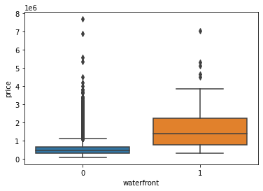

# House Sales in King County, USA
This is a python project for data science. I imported the dataset of House sale prices for King County together with some other features. I split the data into training and test sets and used the training set to train the ridge regression and second order polynomial regression models.
Coefficient of determinations are calculated for both models.


## Install Requirements
```bash
$ pip install -r requirement.txt

```


